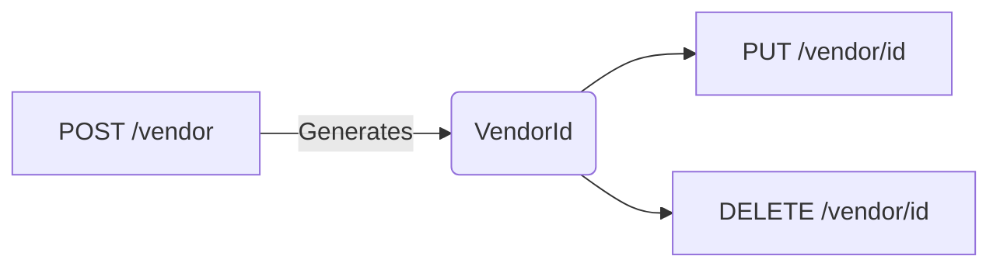

# Admin API End to End Tests

The collection **Admin API E2E** contains a set of tests to verify the
functionality of Admin Api.

The **Admin API** environment file contains the variables needed to execute the
tests.

## Run with Postman

Import the collection and the environment into
[Postman](https://learning.postman.com/docs/getting-started/importing-and-exporting-data/). 

Change the value of the environment variables to the desired values, especially
the *API_URL* variable to match your Admin API URL.

In the API calls, there are examples of with different results for guidance.

To execute the API calls, you can either modify the request to set a specific
value. Additionally, you can execute the API calls in the order where a previous
API call sets the required variables.

Example:



In this example, adding a Vendor will save the VendorId into the variables, then
the update and delete methods will use the saved values to execute the API call.

You can also execute the entire collection to get the results automatically:
[Run a
collection](https://learning.postman.com/docs/running-collections/intro-to-collection-runs/)

## Run with Newman

[Newman](https://learning.postman.com/docs/running-collections/using-newman-cli/command-line-integration-with-newman/)
is a CLI tool to execute Postman collections from the command line. To execute,
install globally ```npm i newman -g``` and execute the following command:

```shell
newman run '.\Admin API E2E.postman_collection.json' -e '.\Admin API.postman_environment.json' -k
```

-k flag is only required when running with local certificate to ignore SSL
errors.

## Adding new API calls

To add a new API call, this can be done manually or importing from the generated
*swagger.json* file and adding tests and examples into the existing collection.
This can then be exported into .json format to be executed from the command
line.

## Tips

* If an error occurs and stops execution of the tests, you may need to manually
  clear out the `TOKEN` variable: click the "..." button for "Admin API E2E" in
  the collection pane; select "Edit"; click on the "Variables" tab; clear out
  the value for `TOKEN`.
* The tests are designed to be run as a suite, rather than running them
  individually. To run individually, it might be useful to modify (temporarily)
  the Register step so that it uses a known client ID and client secret, instead
  of using variables.
