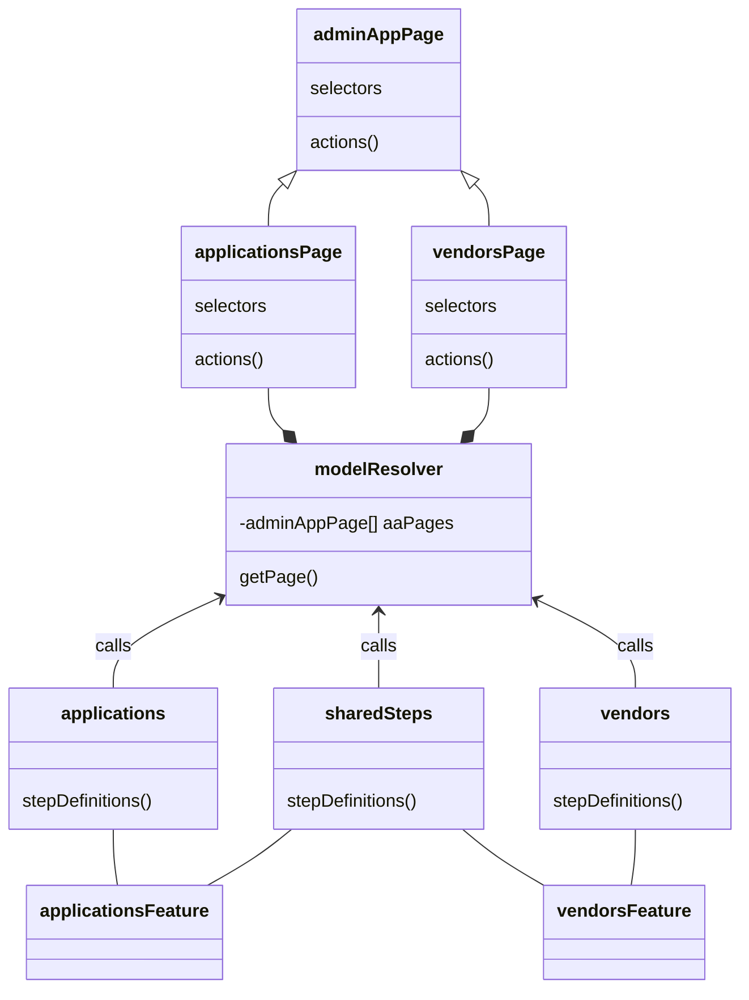

# Admin App E2E Architecture Description

This project uses a BDD structure, using [Gherkin](https://cucumber.io/docs/gherkin/reference/) syntax. The `.feature` classes reference a Typescript class with the definition of the step.

Each definition class references a page using [Page Object Model](#page-object-model). These page objects do not need to be instantiated directly, instead, it should be included into the [modelResolver.ts](./features/models/modelResolver.ts) class using the [Instantiation Pattern](#instantiation-pattern). Then, the modelResolver can be imported into the class an used to call methods of the specific page.

## Instantiation Pattern

To avoid having multiple instances of the same page, there's a class called [modelResolver.ts](./features/models/modelResolver.ts). This class follows the [Singleton pattern](http://wiki.c2.com/?SingletonPattern) and it's instantiated exclusively in the [Before hook](https://cucumber.io/docs/cucumber/api/#hook) to have only one instance per test execution.

The modelResolver class has an array of [adminAppPages](#admin-app-page) and a getter per Page. In the get method, it will try to find the expected Page in the array, if it is not found, it will instantiate the class and push it in the array, to guarantee that there are not multiple instantiations per page.

https://github.com/Ed-Fi-Alliance-OSS/Ed-Fi-ODS-AdminApp/blob/b51b07e8c48686820f3022bcdc7ae741af69406e/Application/EdFi.Ods.AdminApp.E2E.Tests/features/models/modelResolver.ts#L29-L36

> **Warning**
> This does not prevent from instantiating a class and using it in a test. Not using the modelResolver can lead to unexpected behavior.

## Admin App Page

The [adminAppPage.ts](./features/models/adminAppPage.ts) is the parent class of the other page objects. Every page object should inherit from adminAppPage. This has URL validations, an abstract method to define the page path and common functionalities for all pages to make use of and avoid code duplication.

## Page Object Model

[Page Object Model](https://martinfowler.com/bliki/PageObject.html) is a pattern where the classes are divided into Pages. Each page consist of two sections:

1. Selectors: Identification for buttons, titles and sections. This uses CSS classes, text or XPATH when necessary. Following: [Playwright Selectors](https://playwright.dev/docs/selectors#text-selector)

2. Page Actions: These methods execute actions and can return results, but it does not perform assertions.

## Assertions

> **Warning**
> Page Objects should not perform assertions

All assertions should be executed in the implementation of the Gherkin functions. These assertions are done with [nodejs assert](https://nodejs.org/api/assert.html). All assertions should have a custom message to print if the assertion fails, to avoid depending on the built in message.

## Locators

To interact with the browser, we recommend to use Playwright's [Locator](https://playwright.dev/docs/locators) functionality 

# Class Description

This is an example of the architecture for two of the features

