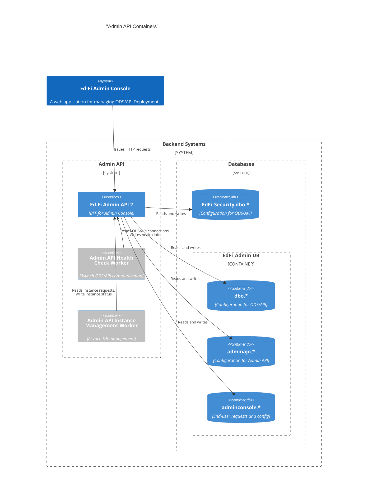

# REST API Support for Admin Console

This document describes the new interfaces and data storage requirements to be
fulfilled directly in the Ed-Fi ODS/API Admin API 2 application, in support of
the Ed-Fi Admin Console and the two worker processes (Instance Management,
Health Check).

## System Context

## Solution Design

We are going to expose the Admin Console endpoints required for the application
in Admin API 2. It will be hosted as a different definition in Swagger and the
base path will be `/adminconsole/{resource}`.

The original Admin Console source code received by the Ed-Fi Alliance included
support for several functional areas that will be excluded in the version 1.0
release of the Ed-Fi Admin Console. The following table lists the functional
areas and their status. Functions that are included in the release plan will be
described in more detail below.

| Function            | Status | Notes                                                          |
| ------------------- | ------ | -------------------------------------------------------------- |
| Tenant management   | ✅      | Will still require manual updates to ODS/API's tenant settings |
| Instance management | ✅      | Asynchronously supported by the Instance Management Worker     |
| Health check        | ✅      | Asynchronously supported by the Health Check Worker            |
| Vendors             | ✅      | Directly supporting `dbo.Vendors`                              |
| Applications        | ✅      | Directly managing `dbo.Applications` (and `dbo.ApiClients`?)   |
| Claimsets           | ✅      | (Read-only?) list of available claimsets                       |
| Onboarding Wizard   | ❌      | May restore in the future                                      |
| User Profile        | ❌      | May restore in the future                                      |
| Permissions         | ❌      | May restore in the future                                      |

### Tenant Management

Path segment: `/adminconsole/tenants`.

Initially, the tenant API will follow the ODS/API's pattern: it will be stored
in the appsettings file. Hence only the `GET` request is supported; modification
support will be restored in the future when tenants move to a database table.

See [Tenant Management Data](./TENANT-DATA.md) for information about the
structure and data of a `tenant` object.

### ODS Instances

**Path segment: `/adminconsole/odsInstances`.**

Supports full create, read, and update operations from the administrative user's
point of view. Does not support delete. Some data that will be managed with
`instance` (described below) should not be available to an end-user and will not
be included in this endpoint. Notably, the `clientId` and `clientSecret` should
be empty strings when responding to the `odsinstances` endpoint requests.

See [Instance Management Data](./INSTANCE-DATA.md) for more information about
this endpoint and its data.

### Instances

**Path segment: `/adminconsole/instances`.**

Supports all CRUD operations, for use by the [Instance Management
Worker](./INSTANCE-MANAGEMENT.md), [Health Check
Worker](./HEALTH-CHECK-WORKER.md), or a system administrator directly accessing
the API with appropriate credentials. Must be secured by Role name in the JSON
Web Token (JWT). Define the role name in appSettings. For more about role
management, also see [Keycloak Configuration](./KEYCLOAK.md).

**Path segment: `/adminconsole/instances/{id}/completed`**

POST operation for the instance management worker only. Supports updating only
the status of an instance, without having to provide a body. For the given ID,
sets the following values on the instance:

* `status`: "Completed"
* `completedAt` set to "now"
  * Started is being set the same initially; in the future there may be a more
    sophisticated process that updates the record as "in progress" with a start
    date.

See [Instance Management Data](./INSTANCE-DATA.md) for more information about
the structure and data of the two `instance` objects.
