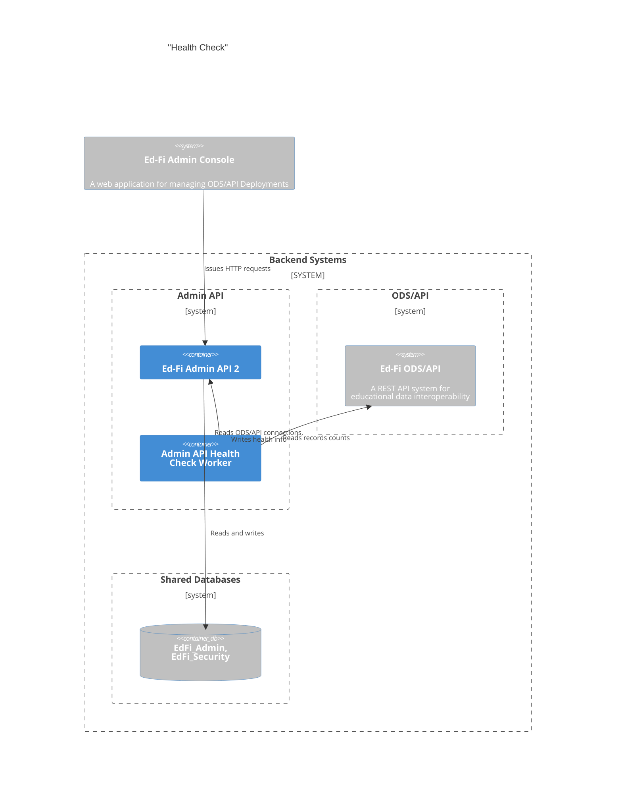
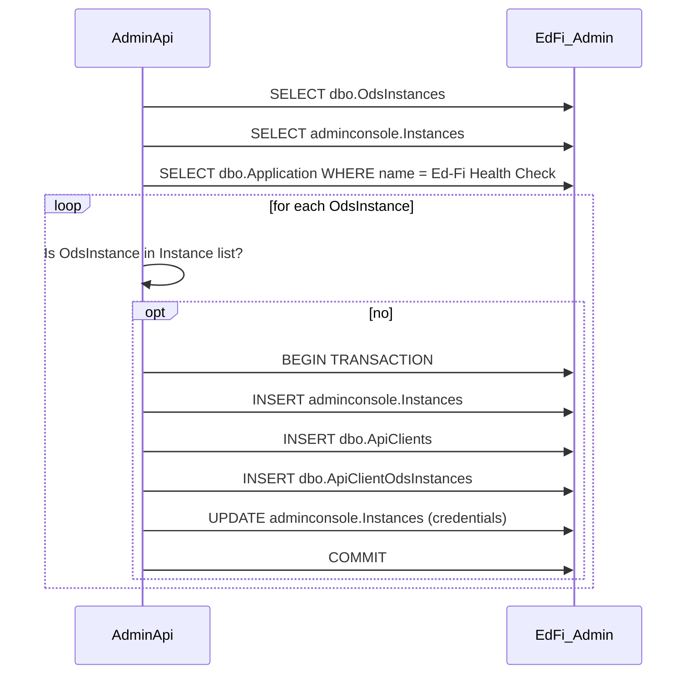

# Health Check Worker

This document describes the work performed by the Admin API 2 application and
its associated Health Check Worker for retrieving and storing record counts from
the ODS/API.

## Containers



## Solution Design

### ODS/API Credentials

The worker needs client credentials (also known as "key and secret") for
accessing each ODS Instance via the API. These credentials need to use their own
read only claimset providing access to all queries resources, using
`NoFurtherAuthorizationStrategy`. By implication then, the system must create
records in the following tables:

1. `dbo.Vendor` creating an "Ed-Fi Administrative Tools" vendor with namespace
   `uri://ed-fi.org`.
2. `dbo.Applications` creating an "Ed-Fi Health Check" application.
3. A new `dbo.ApiClients` and `dbo.ApiClientOdsInstances` record for each ODS
   Instance. NOTE: while it is possible to associate a single `ApiClient` with
   multiple `OdsInstances`, we prefer having a one-to-one relationship.

#### Admin API's Responsibilities

Managing these tables is Admin API 2's responsibility, not the health check
worker's responsibility.

During _deployment_, Admin API 2 should:

1. Create the vendor and application records.
2. Create the readonly claimset.

The health check worker needs to retrieve client credentials from Admin API 2
using `GET /adminconsole/instances`. A system administrator could modify the
`dbo.OdsInstance` and related tables outside of the Admin API 2 application. To
prevent errors, Admin API 2 should synchronize its own `adminconsole.Instances`
table with any new records in `dbo.OdsInstances` each time it starts. While
doing so, it can create client credentials for the Health Check Worker to access
that instance.

The following diagram shows the startup synchronization process. When inserting
into `adminconsole.Instances`, set the status to "Completed".



> [!TIP]
> Whenever the [Instance Management Worker](./INSTANCE-MANAGEMENT.md) creates a
> new ODS database instance, it must also create client credentials. This is shown
> in that document's sequence diagram.

#### Encryption and Storage of Credentials

The stored credentials must be encrypted at rest. When an Admin Console user
wants to review the status of the instances, the Admin Console application will
retrieve the instance information from Admin API 2 via `GET
/adminconsole/instances`. This request _must not_ contain the encrypted
credentials. The data used by the Admin Console are stored as a JSON object in
the `Document` column. The credentials should be stored in a new column:

1. It is easier to avoid returning this information to the Admin Console since
   it does not need to be removed from the `document` body.
2. Minimizing the amount of encrypted information will aid in application
   debugging.

Suggestion: add a new column `Credentials` of type string. Continue using JSON
storage, encrypting a string like the following:

```json
{
    "client_id": "abcdedf",
    "client_secret": "1232142"
}
```

The encryption can utilize the same key that Admin API 2 uses for encrypting
connection strings in `dbo.OdsInstances`.

### Reading ODS/API Record Counts

In this case, we will store the client/secret values in Admin API to call some
of the ODS/API endpoints to generate the returning payload to the Admin Console.
The payload contains a 'total-count' report of some of the resources, it takes
the value from the header in ODS/API.

Example:

```none
https://api.ed-fi.org:443/v7.1/api/data/v3/ed-fi/studentSchoolAssociations?limit=0&totalCount=true
```

The parameter `totalCount` is important to use because this will return us the
count in the header as `total-count`. With this value we can map it to our
payload in the field called `studentSchoolAssociations`.

This process has to be called per field of the payload

ODS/API resources to access:

* studentSpecialEducationProgramAssociations
* studentDisciplineIncidentBehaviorAssociations
* studentSchoolAssociations
* studentSchoolAttendanceEvents
* studentSectionAssociations
* staffEducationOrganizationAssignmentAssociations
* staffSectionAssociations
* courseTranscripts
* sections

> [!WARNING] Unknown fields
>
> * basicReportingPeriodAttendances
> * reportingPeriodExts
> * localEducationAgencyId: We are assuming this as Ed Org Id but we are not sure about this
> * healthy (boolean): We are asumming this as a flag that return true if the above data have been populated correctly and no error from ODS/API

As we have to call multiple endpoints in this one, we are considering use a
caching approach (maybe the in-memory provided by .NET will be enough). If we
want to refresh the data we can send a flag to the endpoint to do so.

### Storing Record Counts

placeholder
