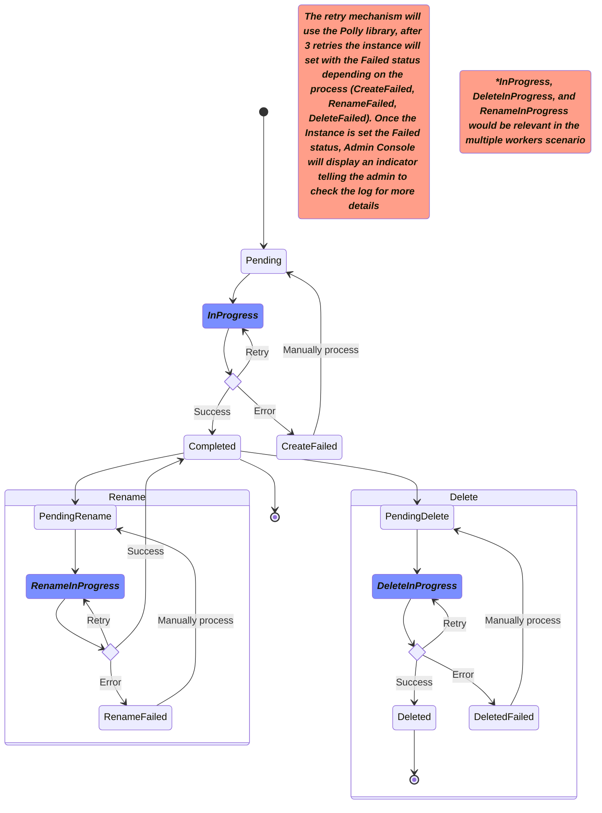

# Instance Management Data

See [APIs for Admin Console: Tenant
Management](./APIS-FOR-ADMIN-CONSOLE.md#tenant-management) for context.

## REST Interface

> [!NOTE]
> Admin Console might not be transmitting Tenant ID in the `POST` request
> as of Jan 20. We may need to modify Admin Console to include this.

### GET /adminconsole/odsInstances

Also supports `GET /adminconsole/odsInstances/{id}`

* **Purpose**: Provide instance list to Admin Console.
* **Description**:
  * Reads from the `adminconsole.Instance` table.
  * No additional authorization required.
  * The `baseUrl` value comes from the tenant information.
  * Respond with 200
* **Response Format**:

  ```json
  [
    {
      "odsInstanceId": 1,
      "tenantId": 1,
      "name": "Instance1",
      "instanceType": "enterprise",
      "baseUrl": "http://localhost/api",
      "odsInstanceContexts": [
        {
          "id": 1,
          "odsInstanceId": 1,
          "contextKey": "schoolYearFromRoute",
          "contextValue": "2024"
        }
      ],
      "odsInstanceDerivatives": [
        {
          "id": 1,
          "odsInstanceId": 2,
          "derivativeType": "Read"
        }
      ]
    }
  ]
  ```

### POST /adminconsole/odsInstances

* **Purpose**: Accept instance creation requests from the Admin Console.
* **Description**:
  * Validate the incoming payload.
  * Insert data into the `adminconsole.Instance` table.
  * Respond with `202 Accepted` and include the new id created.
* **Validation**:

  | Property                             | Rules                                                      |
  | ------------------------------------ | ---------------------------------------------------------- |
  | name                                 | Max length: 100. Must be unique for the tenant.            |
  | instanceType                         | Max length: 100.                                           |
  | odsInstanceContexts                  | Empty array is allowed                                     |
  | odsInstanceContext.contextKey        | Max length: 50. Must be unique for the instance.           |
  | odsInstanceDerivatives               | Empty array is allowed                                     |
  | odsInstanceContext.contextValue      | Max length: 50.                                            |
  | odsInstanceDerivative.derivativeType | Max length: 50. Allowed values: "ReadReplica", "Snapshot". |

* **Sample Payload**:

  ```json
  {
    "odsInstanceId": 1,
    "tenantId": 1,
    "name": "Instance #1 - 2024",
    "instanceType": "enterprise",
    "odsInstanceContexts": [
      {
        "contextKey": "schoolYearFromRoute",
        "contextValue": "2024"
      }
    ],
    "odsInstanceDerivatives": [
      {
        "derivativeType": "ReadReplica"
      }
    ]
  }
  ```

* **Response Format**:

  ```json
  {
    "instanceId": 1,
  }
  ```

### PUT /adminconsole/odsInstances/{id}

* **Purpose**: Update an instance definition.
* **Description**:
  * Validate the incoming payload.
  * Updates both the `adminconsole.Instance` and the `dbo.OdsInstances` tables.
  * Respond with `202 No Content`
  * If the `name` has changed:
    * Set the status to `PENDING_RENAME` in the `adminconsole.Instance` table.
    * Delete records from `dbo.OdsInstances` tables, so that the ODS/API does
      not try to use this database while it is being renamed.
* **Validation**:

  | Property                             | Rules                                                      |
  | ------------------------------------ | ---------------------------------------------------------- |
  | name                                 | Max length: 100. Must be unique for the tenant.            |
  | instanceType                         | Max length: 100.                                           |
  | odsInstanceContexts                  | Empty array is allowed                                     |
  | odsInstanceContext.contextKey        | Max length: 50. Must be unique for the instance.           |
  | odsInstanceDerivatives               | Empty array is allowed                                     |
  | odsInstanceContext.contextValue      | Max length: 50.                                            |
  | odsInstanceDerivative.derivativeType | Max length: 50. Allowed values: "ReadReplica", "Snapshot". |

* **Sample Payload**:

  ```json
  {
    "odsInstanceId": 1,
    "tenantId": 1,
    "name": "Instance #1 - 2024",
    "instanceType": "enterprise",
    "odsInstanceContexts": [
      {
        "contextKey": "schoolYearFromRoute",
        "contextValue": "2024"
      }
    ],
    "odsInstanceDerivatives": [
      {
        "derivativeType": "ReadReplica"
      }
    ]
  }
  ```

<hr />

> [!IMPORTANT]
> The following diagram represents the possible values the Instances
> have during the Worker's process

<hr />



### DELETE /adminconsole/odsInstances/{id}

* **Purpose**: Mark an instance for deletion.
* **Description**:
  * Updates the status of the instance to `PENDING_DELETE`.
  * This operation performs a soft delete by updating the status field; the record remains in the table.
  * Does not immediately remove the instance; it is scheduled for deletion in other related systems.
  * The instance must have a status of `COMPLETED` before it can be marked as `PENDING_DELETE`.
  * Responds with `202 Accepted`.

* **Validation**:
  * The instance must exist.
  * The current status must be `COMPLETED`. If not, the request is rejected with `409 Conflict`.

* **Response Codes**:
  * `202 Accepted` – The instance was successfully marked for deletion.
  * `404 Not Found` – The specified instance does not exist.
  * `409 Conflict` – The instance cannot be deleted because it is not in a `COMPLETED` state.

### GET /adminconsole/instances

Also supports `GET /adminconsole/instances/{id}`

* **Purpose**: Provide instance list for the worker applications.
* **Description**:
  * Reads from the `adminconsole.Instance` table.
  * Must be authorized with an appropriate Role name in the token: `clientId`
    and `clientSecret` must be left blank when this endpoint is accessed by an
    Admin Console user.
  * Returns a separate object for each ODS Instance Context.
  * The `resourceUrl` is constructed from the tenant's base URL plus instance
    context information.
  * `odsInstanceId` will be null if the `status` is not `COMPLETED`.
  * Return all values without the need for paging.
  * Respond with 200
* **Query String Parameters**:
  * `status` to search by Status.
  * `tenantName` to search by Tenant
* **Response Format**:

  ```json
  [
    {
      "tenantId": 1,
      "tenantName": "Tenant1",
      "instanceId": 1,
      "odsInstanceId": 1,
      "instanceName": "Instance #1 - 2024",
      "resourceUrl": "http://localhost/api/2024/data/v3",
      "oauthUrl": "http://localhost/api/2024/oauth/token",
      "clientId": "abc123",
      "clientSecret": "d5rftyguht67gyhuijk",
      "status": "Completed"
    }
  ]
  ```

> [!NOTE]
> In the future the health check worker should use the read replica / snapshot
> if available. For now, it will use the primary database instance.

### POST /adminconsole/instances/{id}/completed

* **Purpose**: Updates the given `adminconsole.Instance` record by changing the
  status to `COMPLETED`.
* **Description**:
  * Responds with `204 No Content` if the record is _already complete_ or if the operations described below succeed.
  * Responds with `404 Not Found` if the Id does not exist.
  * As described in [Instance Management Worker](./INSTANCE-MANAGEMENT.md), this
    action does the following work if the status is not already `COMPLETED`,
    using a single database transaction:
    * Insert into `dbo.OdsInstances`.
    * If needed, insert into `dbo.OdsInstanceContexts` and `dbo.OdsInstanceDerivatives`.
    * Insert into `dbo.ApiClients` to create credentials for the [Health Check Worker](./HEALTH-CHECK-WORKER.md).
    * Insert into `dbo.ApiClientOdsInstances`.
    * Update `adminconsole.Instance` to set:
      * New credentials
      * Status = `COMPLETED`
* **Validation**:

  | Property                             | Rules                                                      |
  | ------------------------------------ | ---------------------------------------------------------- |
  | connectionString                     | Valid mssql or pgsql connection string.                    |

* **Sample Payload**:

  ```json
  {
    "connectionString": "host=localhost;port=5431;username=username;password=password;database=database;application name=AppName;"
  }
  ```

### PUT /adminconsole/instances/{id}

* Not supported at this time. Respond with `405 Method Not Allowed`.

### DELETE /adminconsole/instances/{id}

* Not supported at this time. Respond with `405 Method Not Allowed`.

### POST /adminconsole/instances/{id}/deleted

* **Purpose**: Marks the given `adminconsole.Instance` record as `DELETED`.
* **Description**:
  * Responds with `204 No Content` if the record is already marked as "Deleted" or if the operations described below succeed.
  * Responds with `404 Not Found` if the specified ID does not exist.
  * As described in [Instance Management Worker](./INSTANCE-MANAGEMENT.md), this action performs the following operations in a single database transaction if the status is not already `DELETED`:
    * Delete the corresponding record from `dbo.OdsInstances`.
    * If applicable, delete related records from `dbo.OdsInstanceContexts` and `dbo.OdsInstanceDerivatives`.
    * Delete associated records from `dbo.ApiClients` and `dbo.ApiClientOdsInstances`.
    * Update the `adminconsole.Instance` record to:
      * **Status** = `DELETED`.

### POST /adminconsole/instances/{id}/deleteFailed

* **Purpose**: Marks the given `adminconsole.Instance` record as `DELETE_FAILED` if the database drop operation performed by the Instance Management Worker has failed.
* **Description**:
  * Responds with `204 No Content` if the record is already marked as `DELETE_FAILED` or if the operation succeeds.
  * Responds with `404 Not Found` if the specified ID does not exist.
  * As described in [Instance Management Worker](./INSTANCE-MANAGEMENT.md), this action updates the `adminconsole.Instance` record to:
    * **Status** = `DELETE_FAILED`.

### POST /adminconsole/instances/{id}/renamed

* **Purpose**: Marks the given `adminconsole.Instance` record as `COMPLETED`.
* **Description**:
  * Responds with `204 No Content` if the record is already marked as `COMPLETED` or if the operations described below succeed.
  * Responds with `404 Not Found` if the specified ID does not exist.
  * As described in [Instance Management Worker](./INSTANCE-MANAGEMENT.md), this action performs the following operations in a single database transaction if the status is not already `COMPLETED`:
    * Update the name and connection string
    * Re-insert into the `dbo.OdsInstances` tables and create new Health Check Worker credentials following the procedure used for `POST /adminconsole/instances/{id}/completed`.
    * Set `adminconsole.Instance.Status='COMPLETED'`.

### POST /adminconsole/instances/{id}/renameFailed

* **Purpose**: Marks the given `adminconsole.Instance` record as `RENAME_FAILED` if the database drop operation performed by the Instance Management Worker has failed.
* **Description**:
  * Responds with `204 No Content` if the record is already marked as `RENAME_FAILED` or if the operation succeeds.
  * Responds with `404 Not Found` if the specified ID does not exist.
  * As described in [Instance Management Worker](./INSTANCE-MANAGEMENT.md), this action sets `adminconsole.Instance.Status='RENAME_FAILED'`.

## Future

These endpoints will not be supported in Admin API 2.3, but are under consideration for a future version.

### POST /adminconsole/instances/jobs/start

* **Purpose**: Start processing jobs from the `adminconsole.Instance` table.
* **Description**:
  * Select rows with any of these conditions:
    * Status is "Pending" and `lockDateTime is null`.
    * Status is "In Progress" and `lockDateTime` is expired (expiration timeout
      value to be set in appsettings, for example 60 minutes). _This provides an
      automated retry process_
  * Lock rows in the `adminconsole.Instance` table for processing by setting a
    `jobId` value (UUID) and setting column `lockDateTime` to "now".
  * Changes the status to `In Progress`
  * Responds with `200 OK`.
* **Response Format**:

  ```json
  {
    "jobId": "<int>",
    "instances": [
      {
        "odsInstanceId": 1,
        "tenantId": 1,
        "name": "Instance #1 - 2024",
        "instanceType": "enterprise",
        "odsInstanceContexts": [
        {
          "contextKey": "schoolYearFromRoute",
          "contextValue": "2024"
        }
        ],
        "odsInstanceDerivatives": [
        {
          "derivativeType": "ReadReplica"
        }
        ]
      }
    ]
  }
  ```

### POST /adminconsole/instances/jobs/{id}/completed

* **Purpose**: Mark a job as complete and perform transactional updates.
* **Enhancements**:
  * Accept a job completion payload.
  * Add resultant data to tables `OdsInstances`, `OdsInstanceContext`, `OdsInstanceDerivatives` and update `adminconsole.Instance` status column to mark job as `Compelete` within a single transaction.
  * Roll back on failure.
  * Respond with `200 Ok`.

## Data Storage

No modifications will be made in the `dbo.*` tables.

### adminconsole.Instance

In the normal flow of work, this table will be populated by Admin Console /
Admin API _before_ a matching record exists in the `dbo.OdsInstances` table. The
`Document` column shown below is a flexible JSON object to whatever information
is necessary to support both the user interface and the creation of records in
`dbo.OdsInstances`, `dbo.OdsInstanceContext`, and `dbo.OdsInstanceDerivatives`.
The JSON structure gives the team flexibility for rapid iteration.

Columns that need to be indexed (e.g. `status`) or updated by worker processes
should be real columns, instead of embedding them in the JSON data.

| Column Name   | Type           | Nullable | Purpose                                                      |
| ------------- | -------------- | -------- | ------------------------------------------------------------ |
| InstanceId    | int            | no       | Auto-incrementing identifier                                 |
| OdsInstanceId | int            | yes      | Matching value from `dbo.OdsInstances`                       |
| TenantId      | int            | no       | Tenant identifier                                            |
| Document      | JSON / string  | yes      | JSON document containing all but credentials information     |
| Credentials   | varbinary(500) | no       | Encrypted JSON document with `client_id` and `client_secret` |
| Status        | string         | no       | Pending, Completed, InProgress, or Error                     |
| CompletedAt   | datetime       | yes      | Set this value when completed                                |

> [!NOTE]
> Is `varbinary(500)` sufficient to hold encrypted credentials?
