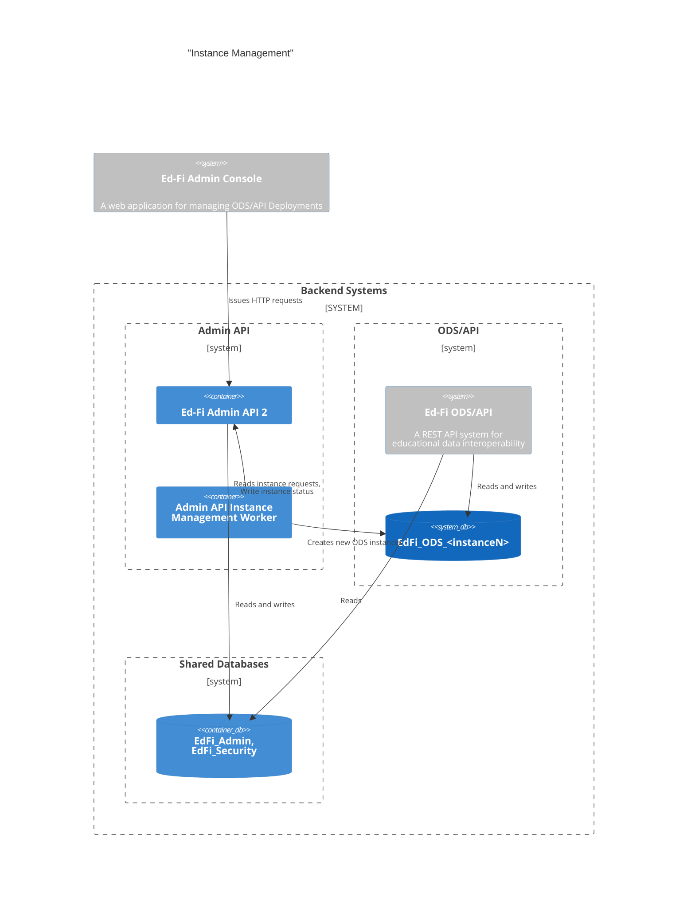
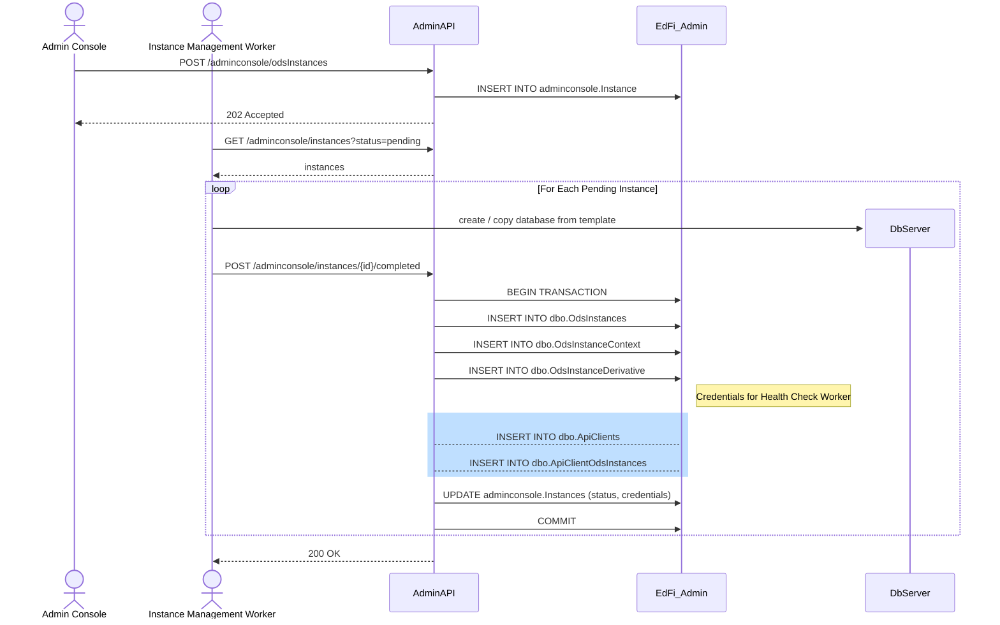
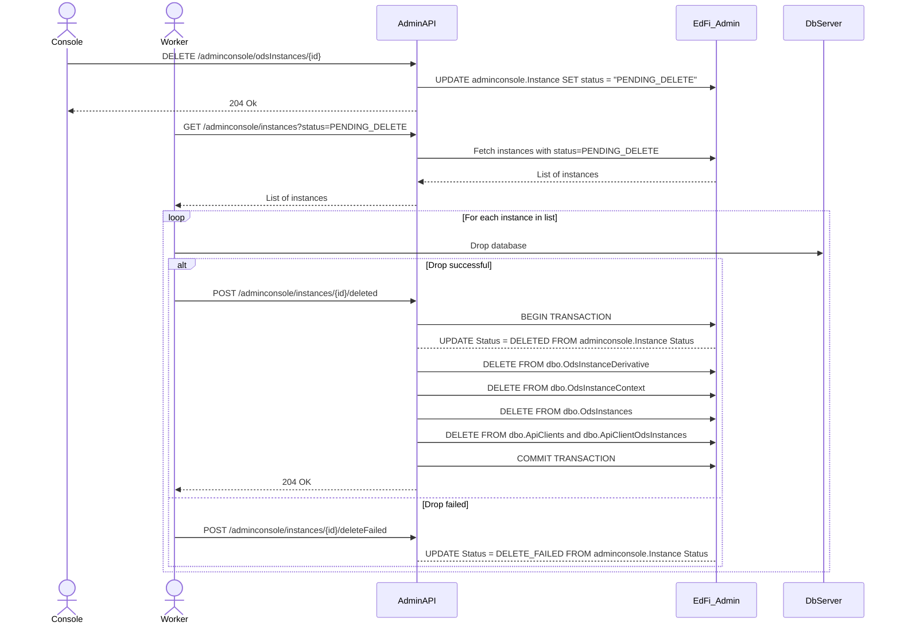
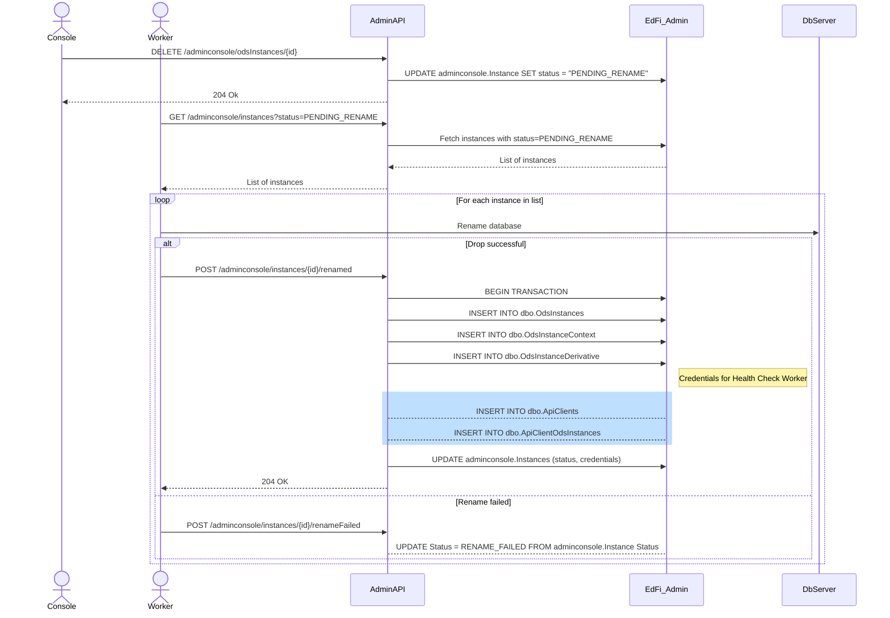
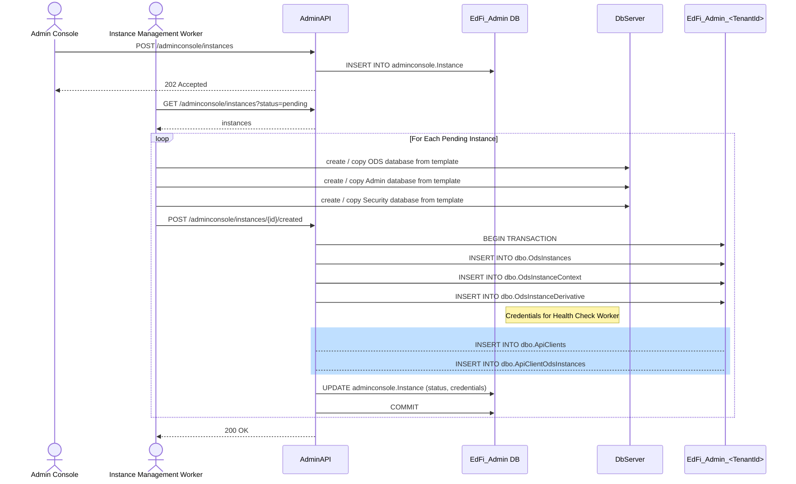
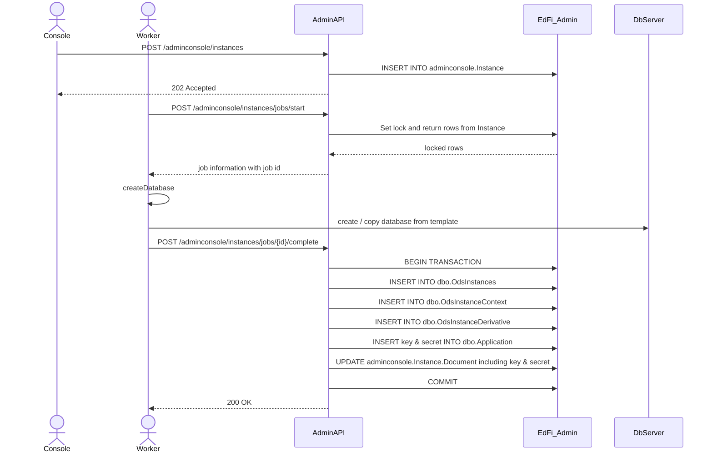

# Instance Management

This document describes the work performed by the Admin API 2 application and
its associated Instance Management Worker for creating or deleting database
instances. Additional features and technical requirements are in the [Instance
Management
Worker](https://github.com/Ed-Fi-Alliance-OSS/Ed-Fi-Admin-Console-Instance-Management-Worker-Process/blob/main/docs/INSTANCE-MANAGEMENT.md)
repository. The document below describes Admin API's role in support of the
worker process.

## Containers

## Functional Requirements

Users will need the ability to perform the following operations for ODS database
instances:

1. Create a new instance and insert records into the `dbo.OdsInstances` and related tables.
2. Rename an existing instance and update the records (including connection string) in `dbo.OdsInstances`.
3. Delete an existing instance and delete records from `dbo.OdsInstances`.
4. Backup an existing instance
5. Restore an existing instance from backup

The first three operations will also require updating the `Status` field in the
`adminconsole.Instance` table. From this perspective, the delete operation will
be a _soft delete_ for audit purposes. That is, the
`adminconsole.Instance.Status` field will be set to "DELETED" instead of
physically deleting the row.

## Solution Design

The Instance Management Worker will be a command line interface (CLI)
application that should run on a schedule, e.g. as a Cron job in Linux or a
Windows Scheduled Task. The Worker's responsibility is to create and manage
ODS database instances ("CREATE DATABASE"). It will pull task information from
Admin API 2, and create databases directly in the RDBMS. It writes status back
to Admin API 2 so that it can update the instance management tables used by the
ODS/API (e.g. `dbo.OdsInstances`).

Ultimately, the solution needs to be robust for error handling, retries, and for
extensibility to support cloud-based platforms. These functions will be built
out incrementally as needed based on feedback from the field:

1. Assume single worker running at a time; fail gracefully; require manual
   intervention when errors occur. Support for "on prem" type of connectivity
   with PostgreSQL and MSSQL. Single Tenant.
2. Multi tenancy - creating additional Admin and Security databases.
3. More robust job handling for concurrent execution.
4. Infrastructure for Cloud managed databases (e.g. AWS Aurora, AWS RDS,
   Azure Cosmos DB, Azure SQL Server, Azure PostgreSQL).

> [!TIP]
> The processes below refer to a new `Instances` table managed by Admin API 2.
> Admin API 2 on startup queries the `dbo.OdsInstances` table used by the ODS/API
> and inserts missing records into the new table. This solves a potential
> synchronization problem between these two tables.

### v1: Single Worker

### New Instance

### Delete Instance

### Rename Instance

### Backup Instance

TBD

### Restore Backup

TBD

#### Health Check Client Credentials

The section in blue is in support of the Health Check Worker, which needs client
credentials for accessing the newly created instance. Admin API 2 will need to
create and store new credentials each time an instance is created. Note that the
credentials are stored in a separate column from the rest of the document
information, and they should be encrypted. For more information, see [Health
Check Worker: Admin API's
Responsibilities](./HEALTH-CHECK-WORKER.md#admin-apis-responsibilities).

### v2: Multi Tenancy

For multi-tenancy support, the Instance Management Worker must also create new
instances of the `EdFi_Admin` and `EdFi_Security` databases. The Admin API
`Instances` table will still be in the original `EdFi_Admin` database.

> [!NOTE]
> Community feedback may suggest creating a single new multi-tenant database
> that is independent of any given `EdFi_Admin` instance / tenant. For now, the
> simplest path forward is to use the first instance.

### v3: Concurrency

The following diagram only displays the single tenant situation, but is easily
adapted to multi-tenancy.

### v4: Cloud Support

> [!NOTE]
> Placeholder. Assuming that the create database process will differ across the
> managed database solutions.