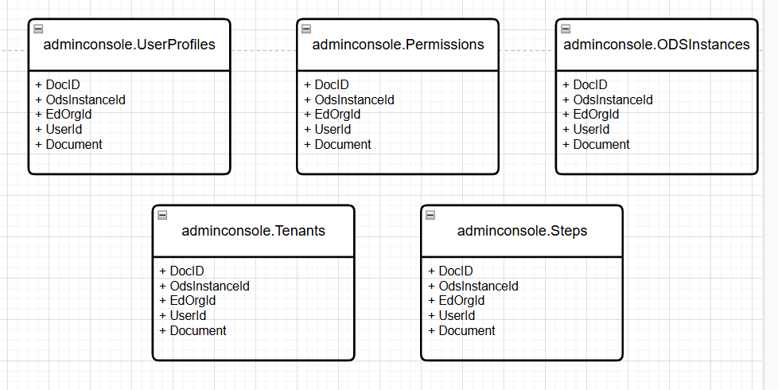
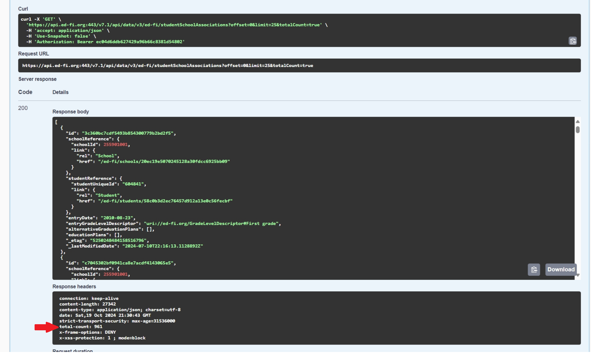

# Admin Console

We are going to expose the Admin Console endpoints required for the application in Admin API. It will be hosted as a different definition in Swagger and the base path <br>
```http://{domain}/adminconsole/{endpoint}```

## Endpoints

[See documentation](./admin-api-adminconsole-2.3-summary.md) <br>
[See OpenAPI definition](./admin-api-adminconsole-2.3.yaml)

The endpoints implementation will return a ExpandoObject type or a list of ExpandoObject in order to keep it dynamically when we need to adjust something in the payloads.

Code reference using mock data:
> This example ilustrates using mock data but the final result will use a persistence using the EdFi_Admin database and other sources. See section [Persistence](#persistence) for more details.

```
internal Task<IResult> GetSteps()
{
    using (StreamReader r = new StreamReader("Mockdata/data-steps.json"))
    {
        string json = r.ReadToEnd();
        List<ExpandoObject> result = JsonConvert.DeserializeObject<List<ExpandoObject>>(json);
        return Task.FromResult(Results.Ok(result));
    }
}

internal Task<IResult> GetStep(int id)
{
    using (StreamReader r = new StreamReader("Mockdata/data-step.json"))
    {
        string json = r.ReadToEnd();
        ExpandoObject result = JsonConvert.DeserializeObject<ExpandoObject>(json);
        return Task.FromResult(Results.Ok(result));
    }
}
```

## Persistence

Tables will be created under the new schema called 'adminconsole' in the EdFi_Admin database.
Tables will have the following design:

* Doc ID - integer/PK
* OdsInstanceId - integer or UUID
* EdOrgID - integer (optional)
* UserID - integer (optional)
* Document - JSONB

We identify the following tables to be created:

* OdsInstances [See JSONB example](../../../Application/EdFi.Ods.AdminApi/Mockdata/data-odsinstances.json)
* Permissions [See JSONB example](../../../Application/EdFi.Ods.AdminApi/Mockdata/data-permissions.json)
* Steps [See JSONB example](../../../Application/EdFi.Ods.AdminApi/Mockdata/data-steps.json)
* Tenants [See JSONB example](../../../Application/EdFi.Ods.AdminApi/Mockdata/data-tenants.json)
* UserProfile [See JSONB example](../../../Application/EdFi.Ods.AdminApi/Mockdata/data-userprofile.json)

> Some of these examples contain sensitive data such as keys and secrets values, so we are thinking of using an encryption/decryption mechanism to store the JSONB data by means of an AES256 alghoritm same as we use in Data Import application.



### Health check endpoint

The healthcheck endpoint has informaction that comes from ODS/API

* Healt check [See JSONB example](../../../Application/EdFi.Ods.AdminApi/Mockdata/data-healthcheck.json)

In this case, we will store the client/secret values in Admin API to call some of the ODS/API endpoints to generate the returning payload to the Admin Console. The payload contains a 'total-count' report of some of the resources, it takes the value from the header in ODS/API.

Example <br>
```https://api.ed-fi.org:443/v7.1/api/data/v3/ed-fi/studentSchoolAssociations?offset=0&limit=25&totalCount=true```

The parameter 'totalCount' is important to use because this will return us the count in the header as 'total-count'. With this value we can map it to our payload in the field called 'studentSchoolAssociations'



This process has to be called per field of the payload

#### ODS/API services to call

* studentSpecialEducationProgramAssociations
* studentDisciplineIncidentBehaviorAssociations
* studentSchoolAssociations
* studentSchoolAttendanceEvents
* studentSectionAssociations
* staffEducationOrganizationAssignmentAssociations
* staffSectionAssociations
* courseTranscripts
* sections

> Unknown fields
>
> * basicReportingPeriodAttendances
> * reportingPeriodExts
> * localEducationAgencyId: We are assuming this as Ed Org Id but we are not sure about this
> * healthy (boolean): We are asumming this as a flag that return true if the above data have been populated correctly and no error from ODS/API

As we have to call multiple endpoints in this one, we are considering use a caching approach (maybe the in-memory provided by .NET will be enough). If we want to refresh the data we can send a flag to the endpoint to do so.

## Authentication and Authorization

The endpoints will use the same Admin API authentication and authorization mechanism provided. Admin API uses [openiddict](https://github.com/openiddict/openiddict-core) library which supports different identity providers (besides its own) like Keycloak so we will have to integrate it in Admin API at some point.

Reference: [OpenIdDict with Keycloak](https://damienbod.com/2022/05/02/implement-an-openiddict-identity-provider-using-asp-net-core-identity-with-keycloak-federation/)
