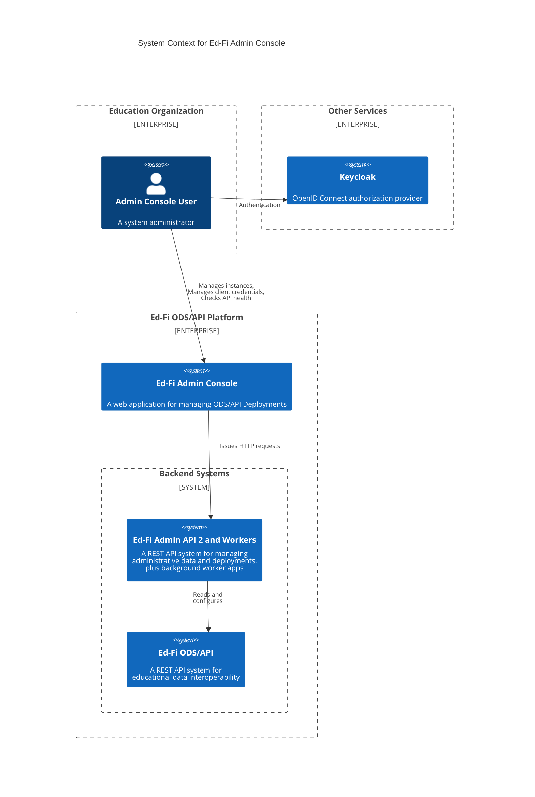
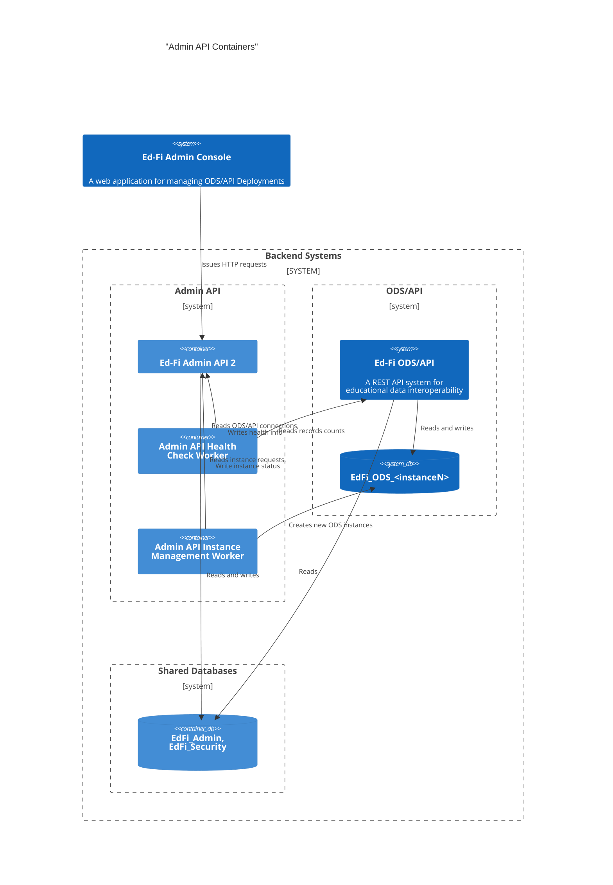

# Admin API Design to Support the Admin Console

## Overview

The Ed-Fi Admin Console is a web-based user interface tool for managing Ed-Fi
ODS/API Platform installations. User can perform actions that include:

* Manage tenants and database instances
* Manage Client credentials ("keys and secrets")
* Review application and database health

The Ed-Fi Admin Console application is a front-end only. The Ed-Fi Admin API 2
application will act as the backend-for-frontend (BFF), serving all of the
interaction needs for Admin Console. The Ed-Fi Admin API 2 will in turn rely on
other services and "worker" applications as needed to achieve some of its goals.

The purpose of this document and related documents is to describe the
architecture of the related applications, the interfaces that sustain
communication, and the storage layers requirements.

> [!TIP]
> The following sections utilize the [C4 model](https://c4model.com/) for
> describing the System Context and decomposing Containers within that Context.
> The notes further refine the architecture with detailed [UML sequence
> diagrams](https://en.wikipedia.org/wiki/Sequence_diagram).

## System Context

## Containers

Two of the functions needed by Admin API 2 will benefit from background
execution, so that the Admin Console end user can experience a quick response
time in the web browser. Two worker applications will provide the background
processing:

1. Instance Management Worker - creates new database instances.
2. Health Check Worker - polls the ODS/API to find record counts and records
   them in Admin API 2.

## Interfaces and Interactions

The API interfaces and the interactions between specific containers are
described in detail in the following documents:

* [REST API Support for Admin Console](./APIS-FOR-ADMIN-CONSOLE.md)
* [Instance Management Worker](./INSTANCE-MANAGEMENT.md)
* [Health Check Worker](./HEALTH-CHECK-WORKER.md)

Also see [Keycloak Configuration](./KEYCLOAK.md) for more information on using
Keycloak as the Open ID Connect provider.
