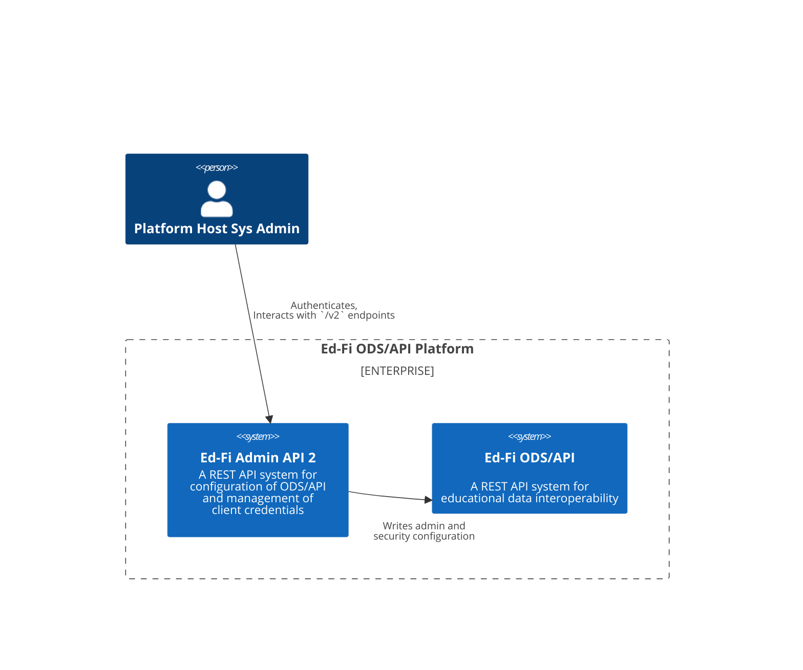
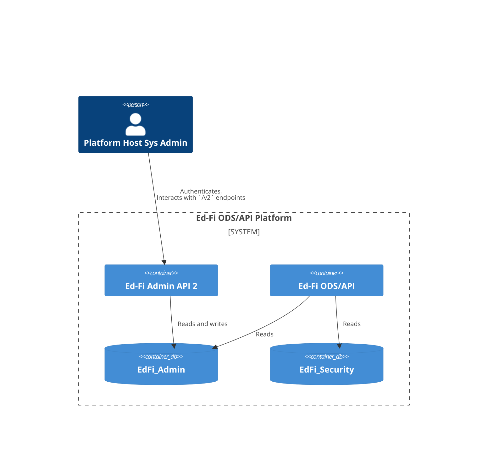
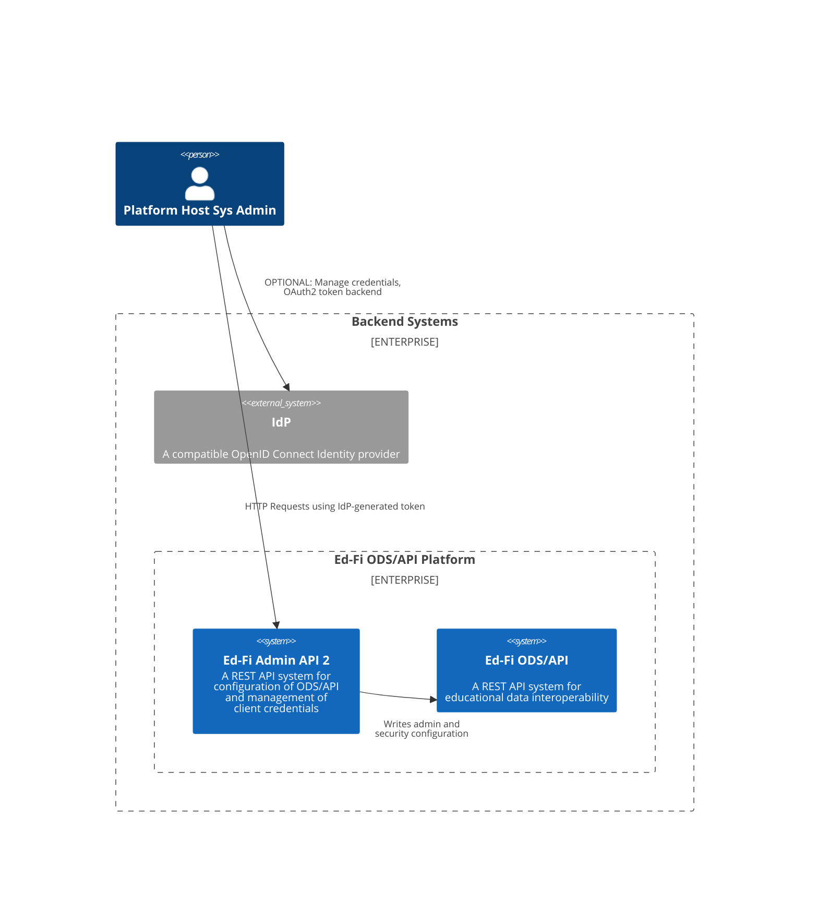
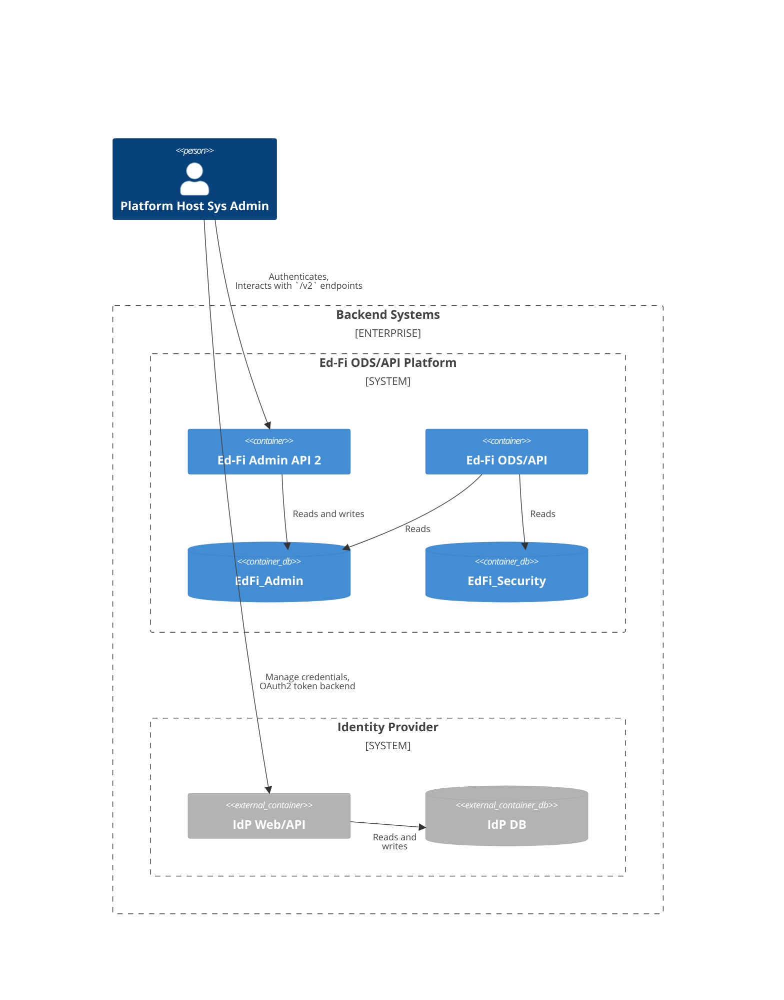
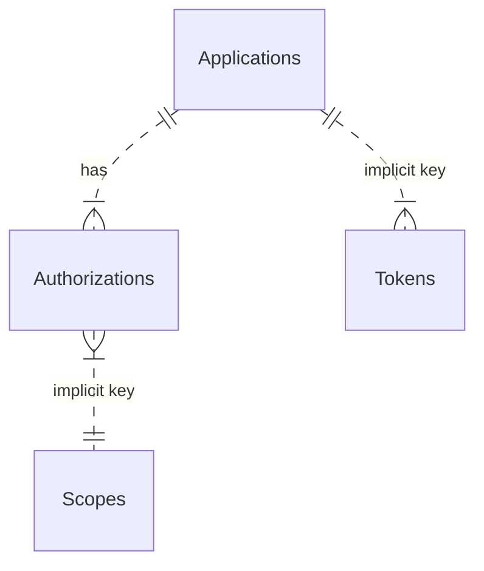

# Authentication and Authorization in Admin API 2.x

Admin API 2 uses [OAuth 2](https://oauth.net/2/) and the [OpenID
Connect](https://openid.net/) ("OIDC") protocol for managing API authentication
and authorization.

## Versions 2.0, 2.1, and 2.2

### System Context 2.0 through 2.2

System administrators interact directly with Admin API to perform ODS/API
configuration tasks and manage client credentials. Authentication and
authorization are [self-contained](./SELF-CONTAINED.md): there is no need for a
third party Identity Provider (IdP). There is a single `OAuth` scope available:
`edfi_admin_api/full_access`.

### Containers 2.0 through 2.2

## Version 2.3 and above

### Self-Contained and Third Party IdP

The [self-contained authentication](./SELF-CONTAINED.md) in Admin API 2.0
through 2.2 was adequate for the application's needs. This support provided
only the `client_credentials` grant flow. OpenIdDict _can_ support users, not
just clients, but the support was unnecessary at the time. With the introduction
of [Admin Console](../adminconsole/readme.md), a user interface that is backed
by Admin API, there is a need for additional capabilities for managing users,
supporting other flows, and providing a user sign-in page.

Therefore, when supporting Admin Console, Admin API will need to rely on a token
generated by an Open ID Connect compatible IdP. The development team will use
Keycloak as their test implementation. However, by using Open ID Connect, it
should be possible to utilize other IdP's.

For backwards compatibility, existing Admin API deployments will be able to
continue utilizing the self-contained authentication without the need to connect
a third party IdP. However, they will not be able to support Admin Console in
this mode.

### Differential Access Rights

#### Client Authorization

The Admin API now supports multiple applications, and the generated tokens will
need to reflect the client's role:

* `adminapi-client`: all clients who access Admin API should have this role.
* `adminconsole-user`: user accounts that access the Admin Console will _also_ have this role.

Thus, the Admin API should reject any token that does not have the
`adminapi-client` role, and the Admin Console should similarly reject a token
that does not have the `adminconsole-user` role.

Roles will be described in the JWT with a new claim called
`http://schemas.microsoft.com/ws/2008/06/identity/claims/role`. This claim name
is for role-based access control in ASP.NET Identity.

#### Resource Authorization

Resources (endpoints) will be protected using OAuth Scopes. Admin API already
has a Scope of `edfi_admin_api/full_access` that provides access to all
reosurces. New scopes are needed for more limited access:

* Admin Console will have two user types: system administrators with full
  access, and tenant administrators with more limited access. Details about this
  more limited access are yet to be determined. **New scope:
  `edfi_admin_api/tenant_access`**.
* The instance management and health check workers do not require full access to
  the API. Their access can be limited with a **new scope:
  `edfi_admin_api/worker`**.

### System Context 2.3+

### System Containers 2.3+

The containers can look exactly as in Admin API 2.0 through 2.2, or
alternatively can use the third party provider, which is shown below. Note that
Admin API does not need to have a direct connection to the IdP.

## Solution Design

### Self-Contained Authentication with OpenIdDict

Admin API integrates [OpenIdDict](https://openiddict.com/) directly into its own
application source code. Client credentials are created via the `/connect/register` endpoint following a
custom protocol. Tokens are generated via the `/connect/token` endpoint.

This integration uses the following database tables:

> [!NOTE]
> "implicit key" in this diagram means that there is no foreign key relationship
> in the database. The author does not know why there is no foreign key, but
> presumably it is for a good reason.

### Third-Party OpenId Connect Provider

Using appropriate .NET package dependencies, it is easy to setup the application
to use any OpenID Connect provider. At minimum, the following settings will be needed

* Authority
* Audience
* Disable HTTPS certificate validation (that is, accept self-signed certificates)
* A signing key. Note: some libraries can retrieve this automatically with `GET
  /.well-known/openid-configuration`. Might need to store that "well known" URL
  in settings. See [COnfigure JWT bearer authentication in ASP.NET
  Core](https://learn.microsoft.com/en-us/aspnet/core/security/authentication/configure-jwt-bearer-authentication?view=aspnetcore-8.0),
  which refers to using the `MetadataAddress` to lookup a public signing key.

_Also see: [Keycloak Integration](./KEYCLOAK.md)_
