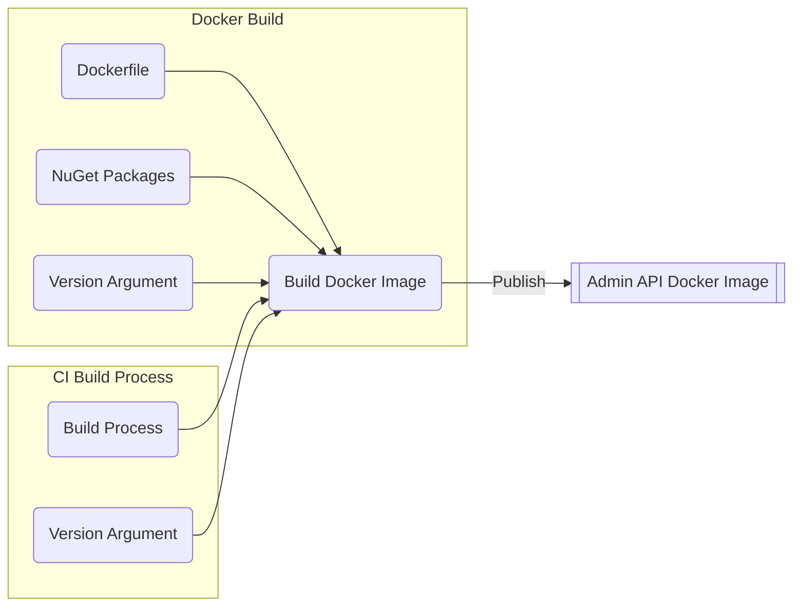
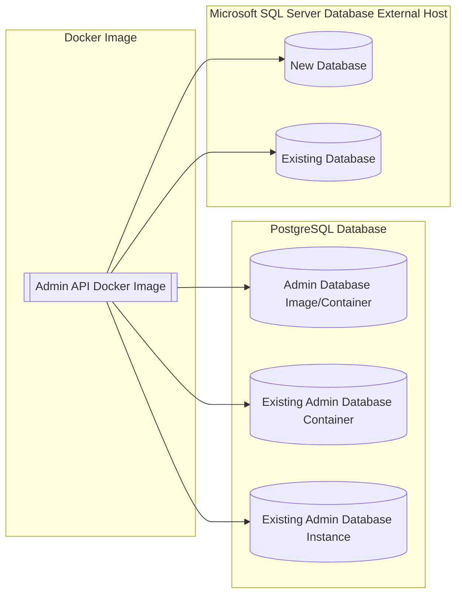

# Docker for Binaries

# User Story

As an Ed-Fi system administrator, I want to run the Ed-Fi ODS Admin API in a container.

# Acceptance Criteria

* Built using the same NuGet packages that the PowerShell installer would use.
* Auto-published with the latest version available.
* Can use a pre-built Admin database image containing Admin API database schema.
* Can use an existing Admin database container, and deploy the database schema into it.
* Can use an existing Admin database instance that is not in a container, and deploy the database schema into it.

# Implementation notes

Today there are three binary-first Dockerfiles in Admin API: Docker/DB-Admin/pgsql/Dockerfile, mssql.Dockerfile, and pgsql.Dockerfile.

The latter two contain the Admin API application runtime, with configuration differences for the two different database providers.

Based on the notes above, this is the support matrix to test:

| Admin API Host | Database Engine | Database Host | Admin DB Status | Dockerfiles
| -----------    | -----------     |-----------    |-----------      |-----------                        |
| Docker         | PostgreSQL      | Docker        |New              |pgsql/Dockerfile, pgsql.Dockerfile |
| Docker         | PostgreSQL      | External Host |New              |pgsql.Dockerfile                   |
| Docker         | PostgreSQL      | Docker        |Already exists   |pgsql.Dockerfile                   |
| Docker         | PostgreSQL      | External Host |Already exists   |pgsql.Dockerfile                   |
| Docker         | MSSQL           | External Host |New              |mssql.Dockerfile                   |
| Docker         | MSSQL           | External Host |Already exists   |mssql.Dockerfile                   |

We do not have rows for MSSQL in Docker because, while it can be done, the Alliance does not provide those images due to licensing restrictions.

The dockerfiles need to accept an argument with the version number, which can default to latest.
The CI build process can pass the correct argument to the docker build command (as seen in the Meadowlark on-prerelease.yml : docker-publish job).
There is a script that can be used for reference in order to get the available versions, sort and find latest. That script would then need to be run from inside the container, or it could be run outside the container before executing `docker build`.
`Get-NugetPackage` and `Invoke-SemnaticSort` are the appropriate commands for this scenario.
Link Reference: <https://github.com/Ed-Fi-Exchange-OSS/Meadowlark/blob/main/eng/bulkLoad/modules/Package-Management.psm1>

The Admin database image should no longer have a reference to the Admin App binary package. Instead, it should retrieve the NuGet package for AdminApi (there will only be one).
Use it to setup the database, then be sure to delete the NuGet package before finalizing the image.

The dev team needs to brainstorm ways of handling the database install into existing containers or external database hosts.

In order to structure the file layout for the packaged binaries, a distinction between "Nuget Packaged" and "Raw Source" versions should be created, for this purpose the follow approach could be applied:

Create a docker directory at the root of the project, which contains these files:

* db.pgsql.admin.Dockerfile

* api.pgsql.Dockerfile or api.mssql.Dockerfile

* The sample docker-compose.yml and other associated configuration files

# Tasks

* Build a Docker image for the Ed-Fi ODS Admin API
* Update the Admin database image to retrieve the NuGet package for Admin API.
* Run the Ed-Fi ODS Admin API in a Docker container with a PostgreSQL database.
* Run the Ed-Fi ODS Admin API in a Docker container with a Microsoft SQL Server database.
* Structure a file layout for the packaged binaries.

# Research

* Database install into existing container or external DB host.

# Admin API Build Process

# Database Distribution and Deployment

