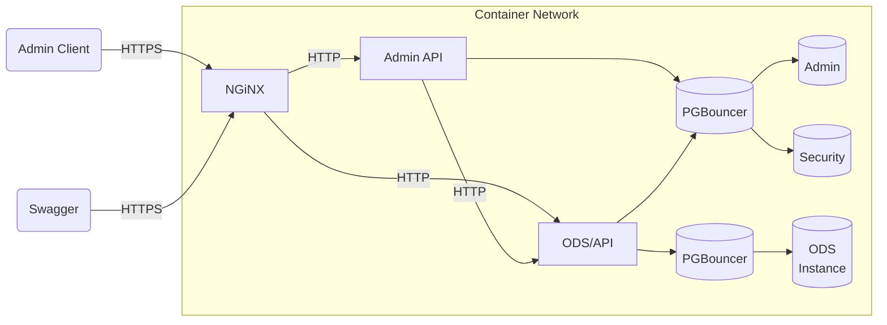
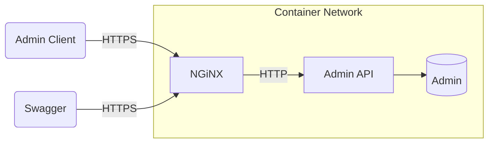

# Docker Support for AdminAPI

Must already have Docker Desktop or equivalent running on your workstation.

## Quick Start for Local Development and Testing



1. From a Bash prompt, generate a dev/test self-signed certificate for TLS
   security. This will create `server.crt` and `server.key` in the `ssl`
   directory:

   ```bash
   cd Application/EdFi.Ods.Admin.Api/Docker/ssl
   bash ./generate-certificate.sh
   ```

2. Copy and customize the `.env.example` file. Importantly, be sure to change
   the encryption key.

   ```shell
   cd ../../Compose/pgsql
   cp .env.example .env
   code .env
   ```

3. Build local containers

   ```shell
   docker compose -f compose-build-dev.yml build
   ```

4. Start containers

   ```shell
   docker compose -f compose-build-dev.yml up -d
   ```

5. Inspect containers

   ```shell
   # List processes
   docker compose -f compose-build-dev.yml ps

   # Check status of the AdminAPI
   curl -k https://localhost/adminapi

   # Check status of ODS/API
   curl -k https://localhost/webapi
   ```

6. Create an administrative (full access) API client (substitute in appropriate
   values for `ClientId`, `ClientSecret`, and `DisplayName`)

   Bash

   ```bash
   curl -k -X POST https://localhost/adminapi/connect/register \
    -H "Content-Type: application/x-www-form-urlencoded" \
    -d "ClientId=YourClientId&ClientSecret=YourClientSecret&DisplayName=YourDisplayName"
   ```

   PowerShell

   ```powershell
   curl -k -X POST https://localhost/adminapi/connect/register `
    -H "Content-Type: application/x-www-form-urlencoded" `
    -d "ClientId=YourClientId&ClientSecret=YourClientSecret&DisplayName=YourDisplayName"
   ```

   :exclamation: Disable new client registration in `appsettings.json` and
   restart the containers.

7. Try using [Swagger UI](https://localhost/adminapi/swagger/index.html) to test
   out the AdminApi.
8. Stop containers

   ```shell
   docker compose -f compose-build-dev.yml down
   ```

## Testing Pre-Built Binaries

This configuration is not intended for live testing or production environments;
its only intention is to simplify installation and testing of Admin API code
that has been bundled into NuGet Packages through the normal development
process, and published to Ed-Fi's Azure Artifacts registry. Note that this
version does not include PGBouncer, though it does preserve NGiNX, and it does
not start the ODS/API.



Instructions are similar to the localhost quickstart above, except use
`compose-build-binaries.yml` instead of `compose-build-dev.yml`.
