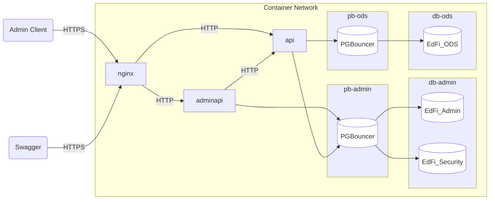
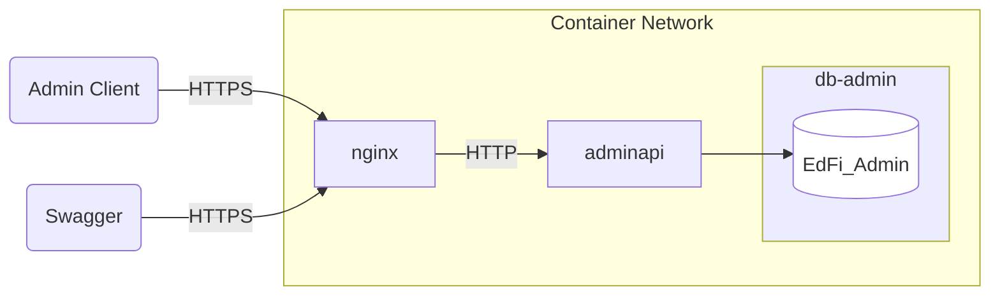

# Docker Support for AdminAPI

Must already have Docker Desktop or equivalent running on your workstation.

## Quick Start for Local Development and Testing

PostgreSQL



1. From a Bash prompt, generate a dev/test self-signed certificate for TLS
   security. This will create `server.crt` and `server.key` in the `ssl`
   directory:

   ```bash
   cd Docker/Settings/ssl
   bash ./generate-certificate.sh
   ```

2. Copy and customize the `.env.example` file. The project has a PostgreSQL
   version (Docker/Compose/pgsql) and a MSSQL version (Docker/Compose/mssql)
   to run the containers. Importantly, be sure to change the encryption key.
   In a Bash prompt, generate a random key thusly: `openssl
   rand -base64 32`.

   PostgreSQL

   ```shell
   cd Docker/Compose/pgsql
   cp .env.example .env
   code .env
   ```

   MSSQL

   ```shell
   cd Docker/Compose/mssql
   cp .env.example .env
   code .env
   ```

   > [!NOTE]
   > The .env file is a shared resource that can be referenced by both the
   > "MultiTenant" and "SingleTenant" compose files.

3. Build local containers (optional step; next step will run the build implicitly)

   ```shell
   docker compose -f SingleTenant/compose-build-dev.yml build
   ```

4. Start containers

   ```shell
   docker compose -f SingleTenant/compose-build-dev.yml up -d
   ```

5. Inspect containers

   ```shell
   # List processes
   docker compose -f SingleTenant/compose-build-dev.yml ps

   # Check status of the AdminAPI
   curl -k https://localhost/adminapi

   ```

6. Create an administrative (full access) API client (substitute in appropriate
   values for `ClientId`, `ClientSecret`, and `DisplayName`)

   Bash

   ```bash
   curl -k -X POST https://localhost/adminapi/connect/register \
    -H "Content-Type: application/x-www-form-urlencoded" \
    -d "ClientId=YourClientId&ClientSecret=YourClientSecret&DisplayName=YourDisplayName"
   ```

   PowerShell

   ```powershell
   curl -k -X POST https://localhost/adminapi/connect/register `
    -H "Content-Type: application/x-www-form-urlencoded" `
    -d "ClientId=YourClientId&ClientSecret=YourClientSecret&DisplayName=YourDisplayName"
   ```

   :exclamation: Disable new client registration in `appsettings.json` and
   restart the containers.

7. Try using [Swagger UI](https://localhost/adminapi/swagger/index.html) to test
   out the AdminApi.
8. Stop containers

   ```shell
   docker compose -f compose-build-dev.yml down
   ```

## Testing Pre-Built Binaries

This configuration is not intended for live testing or production environments;
its only intention is to simplify installation and testing of Admin API code
that has been bundled into NuGet Packages through the normal development
process, and published to Ed-Fi's Azure Artifacts registry. Note that this
version does not include PGBouncer, though it does preserve NGiNX, and it does
not start the ODS/API.



Instructions are similar to the localhost quickstart above, except use
`compose-build-binaries.yml`, `compose-build-idp-binaries.yml` or `compose-build-idp-dev.yml` instead of `compose-build-dev.yml`.

## Multi-Tenant

Instructions are similar to the Local Development and Pre-Built Binaries setups above.

Tenants details can be configured on appsettings.dockertemplate.json file.

For local development and testing, use `MultiTenant/compose-build-dev-multi-tenant.yml`.
For local development and testing with keycloak, use `MultiTenant/compose-build-idp-dev-multi-tenant.yml`.
For testing pre-built binaries, use `MultiTenant/compose-build-binaries-multi-tenant.yml`.
For testing pre-built binaries with keycloak, use `MultiTenant/compose-build-idp-binaries-multi-tenant.yml`.

## Admin Api and Ed-Fi ODS / API docker containers

Please refer [DOCKER DEPLOYMENT](https://techdocs.ed-fi.org/display/EDFITOOLS/Docker+Deployment) for
installing and configuring Admin Api along with Ed-Fi ODS / API on Docker containers for testing.
